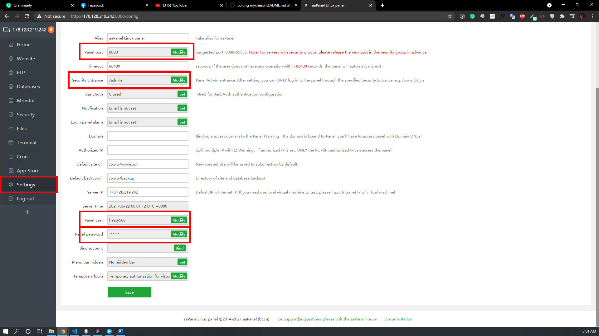
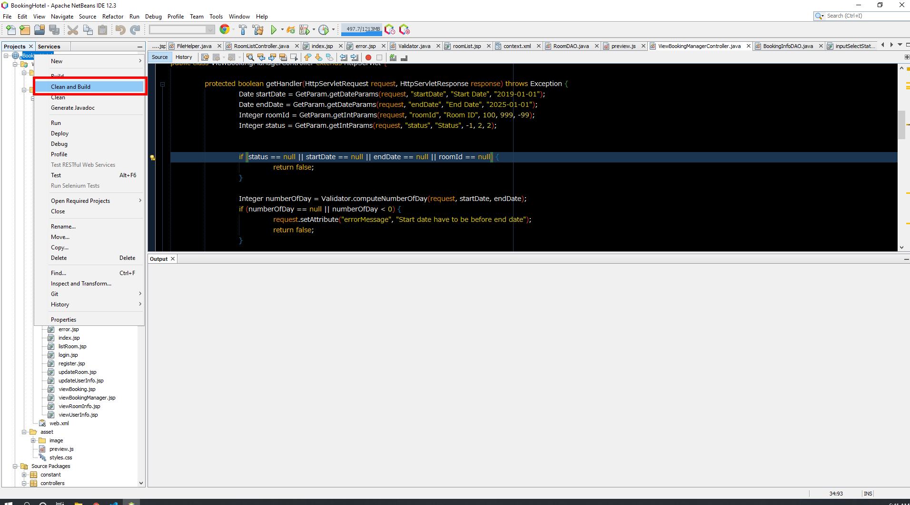
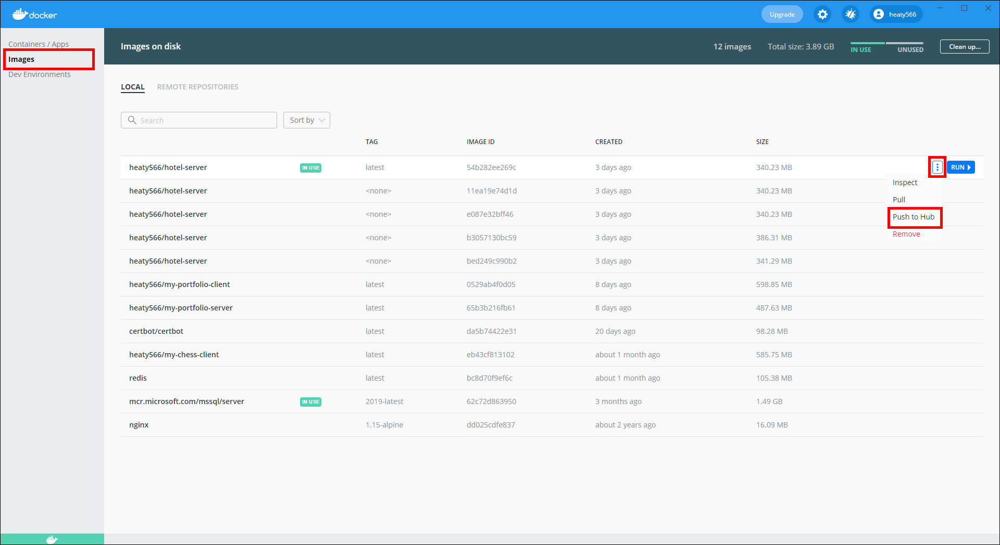
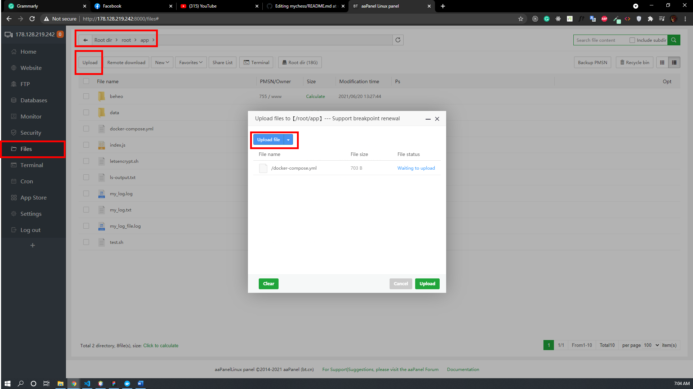
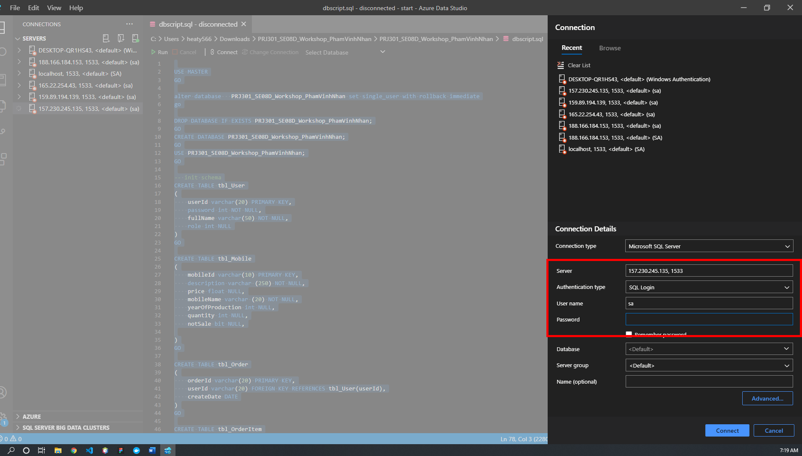
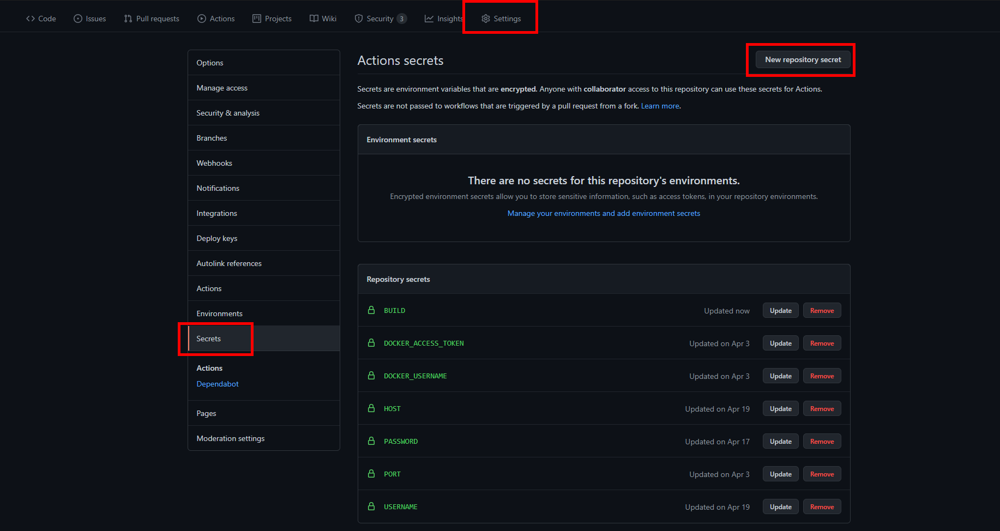

# Simple Deploy For Java Web Application
## How to Deploy
1. ### Buy A VPS ( SQL server requires 2GBs of ram to run)
2. Connect To VPS via CMD and enter your root user password(The password will not appear on the screen when you're typing)

    Syntax
    ```json
    ssh root@<ip>
    ```
    Example
   ```json

    ssh root@178.128.212.244
    ```
3. Install packages

    This command includes docker-compose, dos2unix, aaPanel, vim, turn off firewall, and basic setup.
    Syntax
     ```json
    apt-get update &&
    apt-get upgrade &&
    apt-get install docker-compose &&
    apt-get install dos2unix &&
    ufw disable &&
    cd &&
    mkdir app && 
    cd app &&
    apt-get install vim  &&
    wget -O install.sh http://www.aapanel.com/script/install-ubuntu_6.0_en.sh && sudo bash install.sh &&
    bt 14
    ```
4. Update username password, entrance, and listening port on aaPanel
  

5. Update Dockerfile

    Change Dockerfile with your email and your java web application name

    ```json
        FROM tomcat:8.5.66-jdk8-adoptopenjdk-hotspot

        LABEL maintainer="YOUR_EMAIL@gmail.com"

        ADD /dist/YOUR_JAVA_APP.war /usr/local/tomcat/webapps/


        EXPOSE 8080
        CMD ["catalina.sh", "run"]
    ```
6. Update docker-compose.yml


    ```json
    version: "3"
    services:
            server:
                    build: .
                    image: YOUR_DOCKER_USERNAME/YOUR_DOCKER_IMAGE:latest
                    # Example
                    # image: hello/hotel_app:latest
                    ports:
                            - YOUR_APP_LISTEN_PORT:8080
                            # Example
                            # - 1000:8080 (Listening on port 1000)
                            # - 80:8080 (Listening on port 80, default port when deploy)

            db:
                    image: mcr.microsoft.com/mssql/server:2019-latest
                    environment:
                            - ACCEPT_EULA=Y
                            - SA_PASSWORD=YOUR_DATABASE_PASSWORD
                    volumes:
                            - ./data:/data
                    ports:
                            - 1533:1433
    ```
7. Build Java App By Netbeans 

    

8. Build docker-compose
    
    Flag Options  
    ```json
        -d (Detached mode: Run containers in the background) 
        --build (Build images before starting containers.) 
    ```
    Syntax
    ```json
        docker-compose up -d --build
    ```
9. Push to dockerhub
 
10. Upload docker-compose and delete build
 

    Note: We just need this line in your build PC, not in VPS PC
    ```json
        version: "3"
        services:
                server:
            --> Delete this line  build: .
                        image: YOUR_DOCKER_USERNAME/YOUR_DOCKER_IMAGE:latest
                    
                        ports:
                                - 80:8080
                db:
                        image: mcr.microsoft.com/mssql/server:2019-latest
                        environment:
                                - ACCEPT_EULA=Y
                                - SA_PASSWORD=YOUR_DATABASE_PASSWORD
                        volumes:
                                - ./data:/data
                        ports:
                                - 1533:1433
    ```
11. Run docker in VPS 

    Return to root
    ```json
    cd 
    ```
    Go to app folder
    ```json
      cd app
    ```
    Pull new docker image from docker-hub
    ```json
      docker-compose pull
    ```
    ```json
      docker-compose up
    ```
12. Connect to database online

    In Azure studio or Microsoft SQL Server Management
    ```json
        Server: YOUR_VPS_IP, LISTENING_PORT (157.230.245.135, 1533)
        Authentication Type: SQL Login
        Username: sa
        Password: YOUR_DATABASE_PASSWORD in docker-compose file
    ```
     
13. Update For Project

    When you change your project and need to deploy the latest version of your project
    ```json
        Run step 7
        Run step 8 (with --build flag)
        Run step 10 
        Run step 11 (docker-compose pull && docker-compose up -d)
    ```
## How to setup CI/CD
### Idea
    1. Create listening when some one creates push request to a particular branch on github
    2. Check build ACTIVE option
       (sometime you just need to update your project on github, not VPS server)
    3. Allow Github VPS to pull your repository code, 
       and build docker-compose and push to docker-hub
    4. Github VPS connects to your VPS run some command lines to update docker
### File
```json
name: auto-build-deploy

on:
        push:
                branches:
                        - YOUR_LISTENING_BRANCH 
                        # Example
                        # - deploy 
jobs:
        build-check:
                runs-on: ubuntu-latest
                steps:
                        - name: checking allow to build
                          run: |
                                  if [ ${{secrets.BUILD}} == ACTIVE ] 
                                  then
                                    echo '------------------- ready to deploy --------------------'
                                  else 
                                    echo 'not ready'
                                    exit 1
                                  fi
        build-push:
                needs: build-check
                runs-on: ubuntu-latest
                steps:
                        - name: Checkout
                          uses: actions/checkout@v2
                        - name: Login Docker Hub
                          uses: docker/login-action@v1
                          with:
                                  username: ${{ secrets.DOCKER_USERNAME }}
                                  password: ${{ secrets.DOCKER_ACCESS_TOKEN }}
                        - name: Set up Docker Buildx
                          uses: docker/setup-buildx-action@v1
                          id: buildx
                        - name: Build and Push for Server
                          uses: docker/build-push-action@v2
                          id: docker_build_server
                          with:
                                  context: .
                                  file: ./Dockerfile
                                  builder: ${{steps.buildx.outputs.name}}
                                  push: true
                                  tags: YOUR_DOCKER_USERNAME/YOUR_DOCKER_IMAGE:latest
                        - name: Verify
                          run: |
                                  echo ${{steps.docker_build_server.outputs.digest}}
                                  echo 'Build done, ready to deploy'
        deploy:
                runs-on: ubuntu-latest
                needs: build-push
                steps:
                        - name: executing remote ssh commands using ssh key
                          uses: appleboy/ssh-action@master
                          with:
                                  host: ${{ secrets.HOST }}
                                  username: ${{ secrets.USERNAME }}
                                  password: ${{ secrets.PASSWORD }}
                                  port: ${{ secrets.PORT }}
                                  script: |
                                          cd app
                                          docker-compose pull 
                                          docker-compose up -d
```
### Set Environment Variable
 You have to set some sensitive information for github action.
 
 ```json
    BUILD = ACTIVE (delete this key to prevent github-action to updating on vps)
    DOCKER_ACCESS_TOKEN =  (create this one on docker-hub)
    DOCKER_USERNAME = (Docker username)
    HOST = (VPS IP )
    PASSWORD = (VPS root password)
    PORT =22 (VPS SSH Port )
    USERNAME = root (VPS root username)
 ```
## Thank You So Much
Please give a start if you like this repository
## Training Meeting 
Please contact to me via email or my personal website

Email: heaty566@gmail.com

Website: heaty566.com

## License

MIT